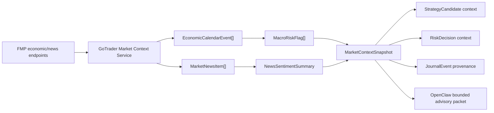

# FMP Economic News Market Context

GoTrader uses Financial Modeling Prep as the first provider behind the provider-neutral **GoTrader Market Context Service**. This layer is separate from market data ingestion. It normalizes economic calendar events, market news, and context-only sentiment into bounded JSON that agents can read without receiving provider secrets or raw provider payloads.

## Authority Boundary

Market context can:

- Add macro/news warnings.
- Reduce confidence in a future Strategy Candidate.
- Create `MacroRiskFlag` records.
- Block future execution windows through the Risk Manager.
- Enrich journal provenance and OpenClaw advisory packets.

Market context cannot:

- Create `side=long` or `side=short`.
- Grant execution permission.
- Bypass the Risk Manager.
- Approve readiness or Paper-Demo Candidate status.
- Expose `FMP_API_KEY`, broker credentials, or raw unrestricted FMP payloads.

## Data Flow



## Provider Endpoints

The first supported FMP endpoints are:

- `/stable/economic-calendar`
- `/stable/news/general-latest`
- `/stable/news/stock-latest`
- `/stable/news/stock?symbols=...`
- `/stable/news/forex-latest`
- `/stable/news/forex?symbols=...`
- `/stable/news/crypto-latest`
- `/stable/news/crypto?symbols=...`

Financial statements, DCF, ratings, ESG, insider data, ownership, transcripts, fundamentals, and alternative data are intentionally out of scope.

## Contracts

The provider-neutral contracts live in `src/lib/marketContext`:

- `EconomicCalendarEvent`
- `MarketNewsItem`
- `MacroRiskFlag`
- `NewsSentimentSummary`
- `MarketContextSnapshot`
- `OpenClawMarketContextAdvisoryPacket`

`MarketContextSnapshot.providerPayloadIncluded` must always be `false`. `boundedEvidence` is limited to the top 10 economic events, top 5 news items, and top 3 macro risk flags.

## Risk Windows

Default economic calendar risk windows:

- High impact: block from 60 minutes before to 30 minutes after the event.
- Medium impact: reduce-risk context from 30 minutes before to 15 minutes after the event.
- Low impact: monitor only.
- Unknown impact: warning/monitor only.

Current Risk Manager behavior remains conservative: every decision defaults to `approved=false` and `executionAllowed=false`. High-impact active flags are included in reject reasons.

## Dry-Run Behavior

If `FMP_API_KEY` is missing, the service uses deterministic mock context:

- One high-impact USD event.
- One medium-impact USD event.
- One forex news item.
- One stock/index-related news item.
- One crypto-related news item.

This keeps contract tests deterministic without live provider access.

## Caching And Rate Limits

The local service uses conservative in-memory server-side caching:

- Economic calendar: 6 hours by default.
- General/forex/crypto latest news: 10 minutes by default.
- Symbol-specific news: 20 minutes by default.

Requests are throttled by `FMP_MIN_REQUEST_INTERVAL_MS` to reduce duplicate calls and remain friendly to free/basic provider tiers.

## Environment

Set these in `.env.local` or the server process environment:

```text
FMP_API_KEY=
GOTRADER_MODE=paper
```

The key must remain server-side. It must never be exposed to Vite/frontend code, OpenClaw packets, logs, journal entries, or browser state.

## Future Providers

The Market Context Service is provider-neutral so the FMP adapter can later be swapped or supplemented with:

- Forex Factory
- TradingEconomics
- FXStreet
- Finnhub
- Alpha Vantage

## Future MT5 And Supabase Position

MT5 execution remains future-only and must sit after the Risk Manager. Supabase journaling will later persist accepted and rejected signals, market snapshots, sentiment snapshot IDs, macro flags, and decision provenance. This phase returns structured journal-ready objects only and performs no Supabase writes.

## Not Implemented Yet

- Live trading.
- MT5 order placement.
- Supabase writes.
- Strategy generation from news.
- Sizing changes from medium-impact events.
- Autonomous execution.
- Frontend API key entry.
